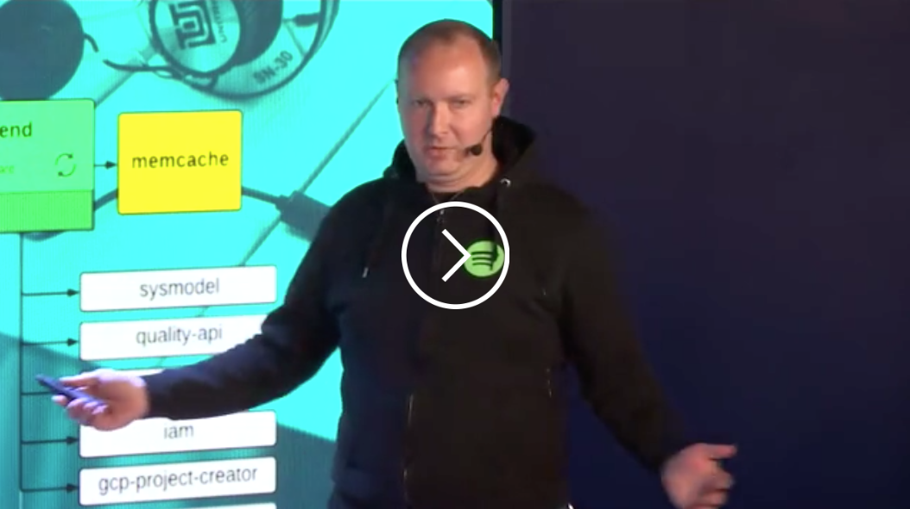
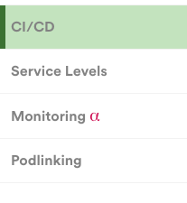

# Plugin Development Overview

## Before we begin

Welcome to the guide for Backstage Plugin Developers! In here you will find the guidelines for creating a coherent and Backstage-compatible Plugin.

Before you begin we recommend going through this [excellent introduction](https://docs.google.com/presentation/d/1ixlz_js6HmvhV-w-pmH0RpKxO0d9X9xXp3I8fteOpSQ/edit?usp=sharing) to ES6 and React by Mikaela Grundin in DI.

There is also a [video](https://videos.spotify.net/backstage-lunch-and-learn-1) ([slides](https://docs.google.com/presentation/d/1u3-6fZcVdzttuMG0WbpvW6o50K-Yw39TKRa2yv5D_Og/edit?usp=sharing)) of a Backstage platform L&L.

[](https://videos.spotify.net/backstage-lunch-and-learn-1)

### Local development

Follow the instructions [here](https://ghe.spotify.net/backstage/backstage-frontend#environment-setup) to get started.

## Plugins

Backstage is a single-page application composed of a set of plugins. Our goal in the Tools squad for the plugin ecosystem is that the definition of a plugin is flexible enough to allow you to
expose anything you like to the rest of Spotify while automating as much of the grunt work as we can.


For each plugin, Backstage provides an API to do the following:

- **Routing**: register to and respond to URL routes
- **Redirects**: register to and respond to URL routes and then redirect to another route (e.g. for backwards compatibility)
- **Analytics Events**: both automated (e.g. routing and Link clicking) plus custom events are tracked and stored in BigQuery

## Plugin Definition

Every plugin should minimally consist of:

- **plugin-info.yaml**
- **index.js**
- **[Name]Plugin.js**

A list of all the current plugins in Backstage can be found in the `src/plugins` [folder](https://ghe.spotify.net/backstage/backstage-frontend/tree/master/src/plugins).

## Creating a Plugin

To create a plugin, run the scaffold script:

```
yarn scaffold-plugin
```


Plugin name and owner (a squad) are mandatory fields.

Of course, plugins can be created manually as well:

1. Create a new folder (e.g. `src/plugins/[pluginName]`)
2. Create a root plugin class extending `PluginBase`
3. Create a plugin manifest `plugin-info.yaml`
4. Import the plugin manifest to your plugin class
5. Override the `initialize()` lifecycle method and setup your plugin's functionality
6. Expose your plugin to the Backstage ecosystem by importing it into `src/plugins/pluginManagerBootstrap.js`

Backstage will automatically validate your plugin manifest, inject the routes and redirects into `react-router`, hook your plugin functionality
into the appropriate backend services (e.g. analytics events), and manage any errors your plugin may have.

!!! tip
Support for TypeScript plugins is now in **Alpha**, see `src/plugins/_examples/typescript` for an example. Contributions to improve the TypeScript experience are very welcome.

**Note**

Your plugin can be incredibly simple! It does not even need to have any routes or pages. It could be a set of components used by other plugins.

## Example Plugin

Our primary example plugin can be found in `src/plugins/_examples`. Our goal is to keep this regularly updated with any changes or updates we make to the
plugin API.

Please use this example plugin as a template or starting point for your own plugin development and consider its code style, formatting, etc. as a demonstration
of our expectations of code quality for your plugin.

#### Links

Please use the `shared/components/Link.js` class for all of your links.

Examples:

```jsx
<Link to="http://www.spotify.com" />
<Link to="/services/my-service" />
<Link email="tools@spotify.com" />
<Link slackChannel="tools" />
<Link slackUser="username" />
```

## New features

### Feature flags

If your feature is not intended for everyone you can conditionally show it under a so called Feature flag.
Some feature flags can be used globally such as `debugmode.enabled`.

Feature flags can be toggled by going to the avatar menu in the Backstage toolbar (the one that has your
profile picture in it), and choosing `Settings`.

The following example registers a feature flag:

```javascript
import { registerFeatureFlag } from "shared/apis/featureFlags/featureFlagsActions";

// ...

export default class MyPlugin extends PluginBase {
  manifest = pluginManifest;

  initialize() {
    // Call registerFeatureFlag in the initialize() method of your Plugin.
    registerFeatureFlag("my-feature");
  }
}
```

Then you can use this to conditionally add your item to either the Tools menu or on the sidebar menu. The following example shows conditionally adding a sidebar menu-item.

```javascript
import FeatureFlags from "shared/apis/featureFlags/featureFlags";

if (FeatureFlags.getItem("my-feature")) {
  sidebar.menu.push({
    title: "My Feature",
    target: `${url}/my-feature`,
    component: () => <MyFeature />
  });
}
```

### Lifecycle (Alpha, Beta, …)

If your feature is not yet fully baked you can use Alpha or Beta labels to inform your customers.



Use the ready-made component in `src/shared/components/Lifecycle/Lifecycle.js`:

```javascript
import { AlphaLabel } from 'shared/components/Lifecycle';
…
<span>Monitoring <AlphaLabel isShorthand={true} /></span>
```
