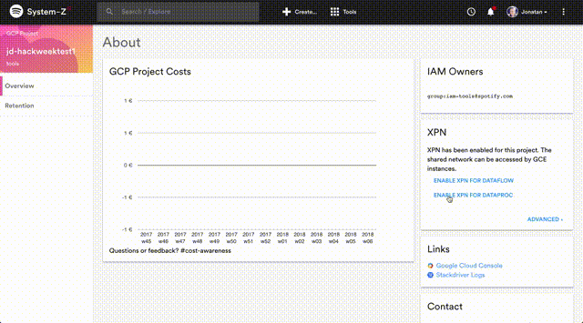
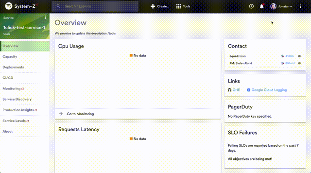

## Error Messages

All error messages from your plugin should be handled on a local level. Follow these simple rules for good error messages:

- Use clear and simple language, avoid obscure error codes and numbers
- Tell the user in plain text what went wrong
- Give the user a suggestion of how to correct the error

Error messages can be shown either in your card (next to where the error occured) or in a dialog or snackbar. Use dialogs for critical error messages and inline error messages or snackbar for informational messages.

## ErrorPanel

The `<ErrorPanel>` component can be used to show an error in the UI. If passed an error property, it will show a "view logs" button that opens the ErrorLog showing the error details.



Example:

```jsx
import React from "react";
import ErrorPanel from "shared/components/ErrorPanel";

class MyComponent extends React.Component {
  // ...
  render() {
    const { error } = this.state;
    return (
      <div>
        {error ? (
          <ErrorPanel message="This didn't work out" error={error} />
        ) : (
          <ListOfThings />
        )}
      </div>
    );
  }
}
```

## Notifications

Global messages and errors can be shown with the `Snackbar` actions.


Example:

```jsx
import React from "react";
import { connect } from "react-redux";
import { Button } from "material-ui";

import {
  snackbarOpenSuccess,
  snackbarOpenError
} from "shared/snackbar/actions";

class MyComponent extends React.Component {
  handleClick = async () => {
    const { snackbarOpenSuccess, snackbarOpenError } = this.props;
    try {
      await fetch("https://someapi.com/hello");
      snackbarOpenSuccess("You did it!");
    } catch (e) {
      snackbarOpenError("This did not work out..", e);
    }
  };

  render() {
    return <Button onClick={this.handleClick}>Click me</Button>;
  }
}

export default connect(null, { snackbarOpenSuccess, snackbarOpenError })(
  MyComponent
);
```

## Error notifications

The snackbar can be used to show errors that do not belong naturally in a UI element. If passed an error object or string, it will show a "view logs" button that will open the ErrorLog showing the error details.



Example:

```jsx
try {
  await updateThing(); // async or sync
} catch (e) {
  // if 2nd param is provided, a "view logs" button will show in the snackbar that'll
  // open the error log and highlight the related error
  snackbarOpenError("Failed to update thing", e);
}
```
