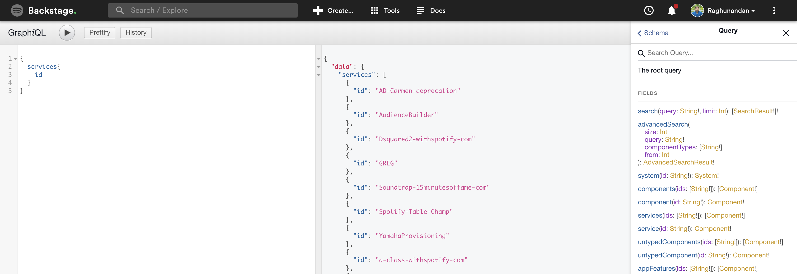
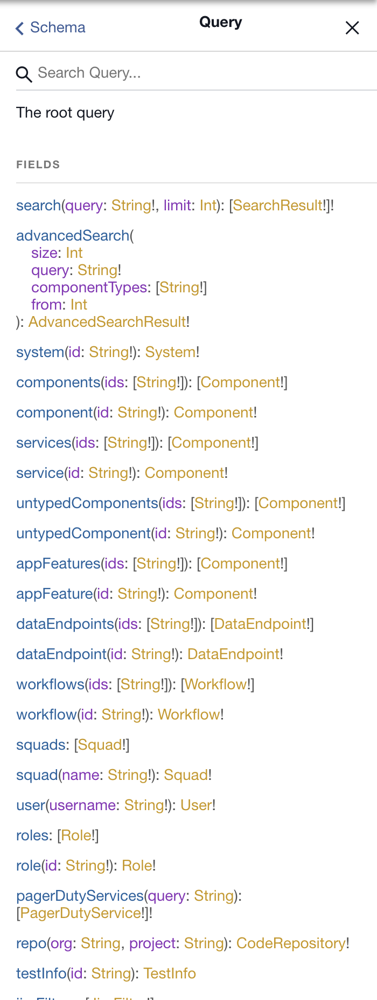

# GraphiQL

## Introduction

We have a query interface in Backstage to explore and query the Backstage [GraphQL](https://graphql.org/learn/) backend schema and data model.



### Simple query

A simple query could be to get the email of a user. The `user` query requires an `username` to be passed in. It returns a `User` object type which in turn have a set of fields with data corresponding to the `User` type.

```
{
  user(username: "username"){
    email
  }
}
```

Type in or copy-paste the above query in the graphiql page and hit play to execute the query. The graphQL backend returns JSON results that would look like this:

```json
{
  "data": {
    "user": {
      "email": "me@example.com"
    }
  }
}
```

Extend the query to include the services owned by the user:

```
{
  user(username: "me"){
    email
    services {
      id
    }
  }
}
```

Another example would be how to get active PagerDuty incidents for the services that my team owns:

```
{
  team(name: "teamname") {
    services {
      id
      pagerDutyService {
        activeIncidents {
          status
        }
      }
    }
  }
}
```

## Explore the schema

A GraphQL schema defines the data structure and the object types and relations between them. In GraphQL the root query defines the entrypoint for all queries.

You can browse the schema by expanding the `Docs` section on top right. Click on query to explore all top level entry points and the related data



## More advanced queries

### Fragments

You will probably see the use of graphQL [fragments](https://graphql.org/learn/queries/#fragments) being used in the code base.

They are used in more complicated queries to construct sets of fields that can be included in queries when you need to.

Here is an example of using the same query as previously, but defining a re-usable fragment and including that in the query:

```
{
  team(name: "teamname") {
    services {
      id
      ...PD
    }
  }
}

fragment PD on Component{
  pagerDutyService {
    activeIncidents {
    	status
    }
  }
}
```

### Query variables

You can pass a separate dictionary of variable definitions to be used in a query. If you are developing a Backstage plugin you will most likely want to dynamically load results based on some variable.

```
query($myUserVariable: String!) {
  user(username: $myUserVariable) {
    username
    services {
      id
    }
  }
}
```

Extend the `QUERY VARIABLES` field in the bottom left and add:

```json
{ "myUserVariable": "username" }
```

## Using graphQL in a Plugin

In the example below we extract the username from the props being passed to the component and use that as a variable in the graphQL query.

We also reference a fragment (`ExamplePage1.fragment`) that could be re-used in other parts of the code.

```jsx
import React, { Component } from "react";
import gql from "graphql-tag";
import QueryLayout from "shared/components/layout/QueryLayout";

export default class ExamplePage1 extends Component {
  static fragment = `
    fragment PD on Component {
      pagerDutyService {
        activeIncidents {
          status
        }
      }
    }
  `;

  render() {
    const { username } = this.props;

    const query = gql`
      query($myUserVariable: String!) {
        user(username: $myUserVariable) {
          username
          services {
            id
            ...PD
          }
        }
      }
      ${ExamplePage1.fragment}
    `;

    return (
      <QueryLayout query={query} variables={{ myUserVariable: username }}>
        {data => {
          return (
            <span>
              <pre>{JSON.stringify(data, null, 2)}</pre>
            </span>
          );
        }}
      </QueryLayout>
    );
  }
}
```
