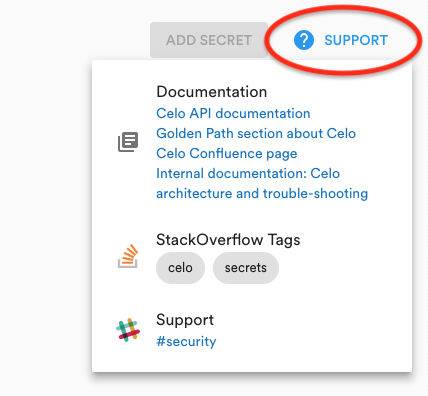
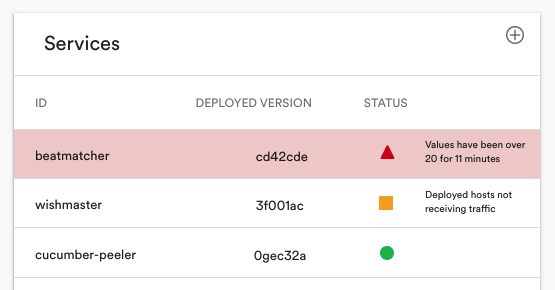

## Page

Your Plugin should live inside a **Page**.

A `Page` has a `title` property and includes children in the following way:

```jsx
<Page title="Data endpoint">
  <ContentHeader title="Data Request">
    <SupportButton slackChannel="jump-cannon" email={["jc@spotify.com"]}>
      <Typography>Data Access</Typography>
      <Documentation>
        <Link to="https://docs.google.com/document/d/1R496L_8mSJf2LRJLFsnLxCwt_XIe51lHSpUfTRxaMV4/edit?usp=sharing">
          Silver Path
        </Link>
      </Documentation>
      <StackOverflow>
        <StackOverflowTag tag="access" />
        <StackOverflowTag tag="gdpr" />
        <StackOverflowTag tag="datasets" />
      </StackOverflow>
    </SupportButton>
  </ContentHeader>
  <MyAwesomeContent />
</Page>
```

## Using cards

The content of your plugin should always be displayed in at least one `<InfoCard>`. Never ever put any content straight in the content area.

Try to divide the different parts of your plugin into cards, without cluttering the content area with too many cards. A good guideline is to have a maximum of four cards displayed of each page of your plugin. If you have only full-width cards that stack on top of each other, make sure the user doesn’t have to scroll too much to see all the content. In the case of very tall or many cards, consider splitting the content up into tabs instead.

All cards should have a title that describes what the card is about. If you feel tempted to have sections inside a card (with their own titles), you should probably divide the card into several different cards. The title should be short and only span over one row. Avoid having entity names in titles; when the card is used in dashboards the entity name can be added to the title.

## Support buttons

The `<SupportButton>` (or Help) button is located in the top right corner of each plugin page. Here you can put links to relevant documentation concerning your view, and also a link to a support channel (Slack) where users who encounter problems can get help.



Example:

```jsx
<SupportButton slackChannel="support-channel" email={["me@example.com"]}>
  <Typography>Support</Typography>
  <Documentation>
    <Link to="https://docs.google.com/document/<mydocument>/edit">
      All my documentation is here
    </Link>
  </Documentation>
  <StackOverflow>
    <StackOverflowTag tag="android" />
    <StackOverflowTag tag="ios" />
  </StackOverflow>
</SupportButton>
```

## Page actions buttons

You can attach one or more action elements to the top of the `ContentHeader`. Typically this is a list of `<Button>`'s.


Example:

```jsx
<Page>
  <ContentHeader title="Overview">
    <Button variant="raised" color="primary">
      Create Group
    </Button>
    ...
  </ContentHeader>
</Page>
```

## Typography

As far as it’s possible, use Material-UI `<Typography>` and already built-in styles that comes with the Backstage platform. Do not use your own inline styles or fonts.

### Tables

Use the powerful and flexible `<DataGrid>` component wrapped in a `<InfoCard>`.



## Icons

Use icons sparingly and only when the meaning is clear and unambiguous. Icons should not be used on or in buttons. Unless colour is needed to convey meaning or used as a logo, they should be in `#7A7A7A`. Check the icon set from [Material Design](https://material.io/tools/icons/?style=baseline) if you can find a fitting icon there before looking for icons elsewhere.

Icons should be in the size of `16x16` or `32x32`, depending on where they are used.

Icons can be used as links or buttons - links leading the user somewhere, like a Github icon leading to Github, or a sorting icon sorting some content. Avoid using icons _instead_ of CTA buttons (e.g. “Create new X”).

## Colours

Colours should be used very sparingly. Avoid using any other colours than the ones used as status markers and the highlight colour for the context you are in. Graphs are an exception where more colours are allowed.

### Status markers

Status markers are used in e.g. tables to show, well, the status of something. You can use three levels of statuses - green, orange and red. Each status marker also comes with a shape, to make it easier for colour blind people to distinguish them from each other. Please do not use other status markers than these, and use them with the same meaning as displayed below.

Use components `<StatusOK />`, `<StatusError />`, etc. Example usage:


Status messages that are connected to the status should be shown in plain text next to the status marker. Messages should only be shown for red or orange statuses. Please keep your messages as short and to the point as possible.

## Buttons and links

As a simple basic rule for using buttons and links: Buttons do something, links lead somewhere.

Use buttons when the click leads to an action or something executing - such as launching a popup, starting or stopping something that is running or performing a search. Links are used when leading the user to a new page, either in the Backstage or to an external page/tool/system. Icons can also be used as links or buttons, refer to the icon guidelines for instructions.

## Dialogs

Dialogs are pop-ups that show a short message or prompts the user to confirm an action. Use dialogues when the user wants to perform a potentially destructive and irreversible action. Dialogues can also be used for certain types of error messages.

Dialogs should be modal, that is lock the interface until the user chooses an action and/or closes the dialog.

## Forms

Backstage supports advanced form validation.

Forms can be displayed in either a card or in an overlay/popup. The general rule is that if you need to press a button to reach the form it should be displayed in a popup, and if your plugin relies on a form being filled in before displaying anything it should be displayed in a card in the content area. An example of the former situation would be to add a new Service Level Tracker in the Service Levels plugin for backend services. An example of the latter would be the 1-click Apollo service creation, which doesn’t display any kind of information but is a setup form only.

## Time

### Packages

Backstage comes with the `moment` and `react-moment` modules. It is recommended to make use of them for displaying and processing time in the interface.

The former, lower-level module can be appropriate when JavaScript code wants to process time. The latter permits the user to put `<Moment>` tags in their JSX code, which automatically refresh occasionally and have convenient options for all kinds of time display needs.

Please refer to the documentation for either package for usage instructions.

### Format

Relative time can be shown as e.g. “X hours ago”. This is supported by `moment` through the use of `fromNow`.

## Loaders

If you have data that takes a long time to load you should use a loader to show that something is happening and not lock up the whole interface. Please always use the `<Progress />` component.

```jsx
import Progress from "shared/components/Progress";

class MyComponent extends React.Component {
  render() {
    return <Progress />;
  }
}
```
